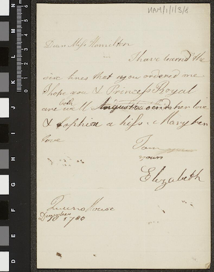
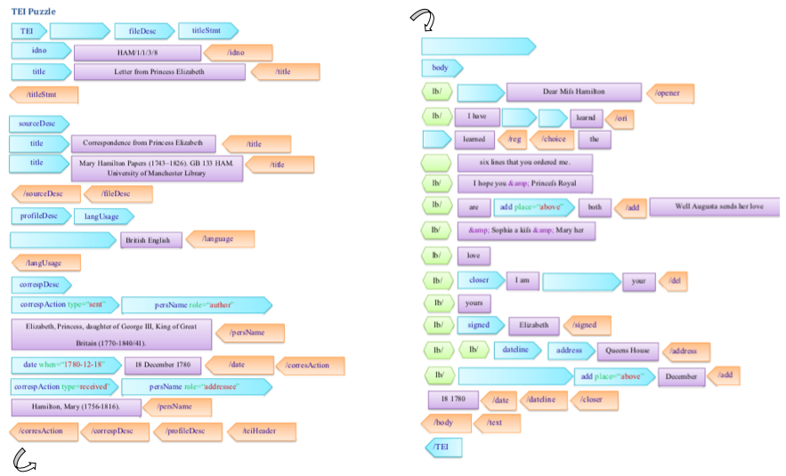
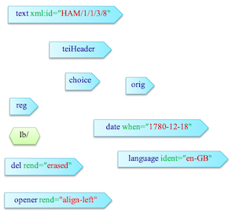
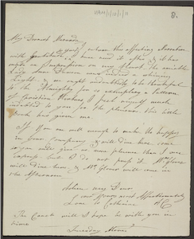
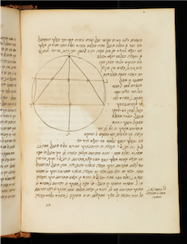

## What is TEI?

TEI stands for: the Text Encoding Initiative. 
It has been developed to describe text based objects (eg. manuscripts, archives, letters) 
but is also being used in some cases to describe visual materials. TEI (helpfully) is actually three things: 

- it is a set of **guidelines** for describing objects and structuring information.
- it is an **organisation** which oversees the production of official guidelines (more on this later).
- it is a **community of practice** of people using the guidelines.


TEI is one kind of **mark up language**.  
Markup encodes information about text – so it could describe the structure, appearance and content of a text. 
Digital markup has to be explicit and unambiguous so that a computer can understand it.

TEI is **based on XML** (eXtensible Markup Language), which is a descriptive markup language. EAD (encoded archival description), 
used to describe archival materials, also uses xml. 
Markup can be presentational (it tells you about how the text appears on the page eg. line breaks, tabs etc.), 
procedural (it gives an output device, for example a printer, 
information about how it should deal with text) or 
descriptive (it encodes the structure of the text, but not what to do with it).
(Coombs, James H., Allen H. Renear, and Steven J. DeRose. 1987. "Markup Systems and the Future of Scholarly Text Processing." 
in (Landow and Delaney 1993))

TEI is very **broad and flexible** – it can be used in many ways. 
At the moment, at The Unversity of Manchester Library, we are using it primarily as a mechanism for **structuring** information.

*IMG: Photo by Ashkan Forouzani on Unsplash*


### XML examples
XML is made up of content, elements and attributes.


#### XML content and elements

```xml
<layout>
	<p>1 column, 25 lines</p>
</layout>
<pb/>
```

Here you can see the ‘human readable’ content – `1 column, 25 lines` (it describes how a manuscript page is laid out) – 
this is what gets displayed on a viewer or online catalogue (or in a PDF version). 
This is surrounded by elements which structure the information. Like in html, the element also determine the formatting of the content.

The common element `<p>` for paragraph, is nested inside the element `<layout>`

Every element has an opening and closing ‘tag’. The beginning of the element is denoted by the element name in angled brackets. 
The end of the element has a slash before the element name. 
You can get ‘empty’ elements without content, like page break `<pb/>` (this functions as the beginning and end of an element).


#### XML attributes with values

```xml
<layout columns="1" writtenLines="25">
  	<p>1 column, 25 lines</p>
</layout>
```
Elements can also contain ‘machine-readable’ content. This can be used to search and filter through large datasets.

Here, the number of columns and lines is also given in the attributes.

The attribute names are shown here in olive brown. This is followed by an equal sign, then the content in double quotes.


## How is TEI constructed?
Don’t worry, you don’t need to remember this!

```xml
<?xml version="1.0" encoding="UTF-8"?>
<TEI>
	<teiHeader>...</teiHeader>
	<facsimile>...</facsimile>
	<text>...</text>
</TEI>
```

There are three main elements in a TEI file: header, facsimile and text. All the other elements are nested in one of these.

- The `<teiHeader>` describes both the TEI file itself and its ‘source’ (i.e. the object which is being encoded).
- `<facsimile>` is where metadata about digital facsimiles (images) is provided.
- `<text>` is where the text is transcribed.
 
IMG: outline view from Oxygen

The images are from screenshots of the ‘outline’ view in the Oxygen editor – you can use this to navigate around a TEI document. 
XML enables linking between sections. 
For example, if you describe an illustration in the header, this can be linked to via the facsimile section. 

We’re not going to cover here how the facsimile section is arranged.


### Header

```xml
<TEI>
	<teiHeader>
		<fileDesc>
			<titleStmt>Catalogue of Latin Manuscripts</titleStmt>
			<publicationStmt>The University of Manchester Library</publicationStmt>
			<sourceDesc>...</sourceDesc>
		</fileDesc>
		<encodingDesc>...</encodingDesc>
		<profileDesc>...</profileDesc>
		<revisionDesc>...</revisionDesc>
	</teiHeader>
	<facsimile>...</facsimile>
	<text>...</text>
</TEI>
```

 - `<fileDesc>` – this describes the TEI file itself, for example its title, author and publication details (including rights statements), and contains the description of the source, such as the manuscript. We’ll cover this in more detail at the next workshop.
 - `<encodingDesc>` – this describes how the file has been encoded, including what taxonomies are used (for example states that Library of Congress Subject Headings are being used).
 - `<profileDesc>` – includes the subject headings themselves, information about language, and can contain `correspDesc`.
 - `<revisionDesc>` – where you record any changes to the file (should have date and name, and can also include details of changes made).

### Text

```xml
<TEI>
	<teiHeader>...</teiHeader>
	<text xml:id="HAM/1/1/3/8">
		<body>
			<pb n="1"/>
			<lb/>...
			<opener>Dear ...</opener>
			<lb/>...
			...<choice>learnd</choice>...
			<lb/>...
```

The text can be divided into three main components:
 - `<front>` – for front matter – title, prefaces, contents page etc.
 - `<body>` is the main body of the text!
 - `<back>` is the back matter – indexes etc.
 
You can also ‘nest’ other texts within text.

> ## Scholarly apparatus
> TEI is used to transcribe texts in a systematic and complex structure – called ‘scholarly apparatus’. 
> We’re keeping it simple. For the exercise, we are only using `<body>`, which can be divided into divisions, 
> and also by page breaks and line breaks.
{: .callout}

> ## Try out a TEI puzzle
> 
> [](../fig/HAM_1_1_3_8_large.png)
> Source: HAM/1/1/3/8, John Rylands Library, licence CC BY-NC 4.0
> 
> This puzzle will help you to put together your very first TEI record by filling in the blanks. 
> It is based on one of the Mary Hamilton letters.
> As you work through it, have a think about what some of these elements might mean.
>
> 
>
> **For the puzzle above, where would you insert the following pieces?**
> 
> Download the [puzzle as a Word document](../files/TEI_Exercise_Puzzle.docx) or [PDF](../files/TEI_Exercise_Puzzle.pdf).
>
> > ## Solution
> > 
> > The missing elements appear in the following order:
> > 1. `<teiHeader>` -  the header of the record
> > 2. `<language ident="en-GB">` - what language the item is written in, with a standard code
> > 3. `<text xml:id="HAM/1/1/3/8">` - the beginning of the text, with an identifier
> > 4. `<opener>` - the opening address
> > 5. `<choice>` - there is a choice of words that could be used
> > 6. `<orig>` - the original written word, perhaps with an archaic spelling
> > 7. `<reg>` - the regular written word, using today's spelling
> > 8. `<lb/>` - a line break (note, this element is already closed, it has a `/` inside it)
> > 9. `<del rend="erased">` - a word that the author deleted but we can still interpret
> > 10. `<date when="1780-12-18">` - a date that appears, coded in a machine-readable way (YYYY-MM-DD)
> >
> > ```xml
> > <TEI>
> > 	<teiHeader>
> > 		<fileDesc>
> > 			<titleStmt>
> > 				<idno type="reference">HAM/1/1/3/8</idno>
> > 				<idno type="image">HAM-1-1-3-8.pdf</idno>
> > 				<title>Letter from Princess Elizabeth to Mary Hamilton</title>
> > 			</titleStmt>
> > 			<sourceDesc>
> > 				<bibl>
> > 					<title>Correspondence from Princess Elizabeth</title>
> > 					<p>Mary Hamilton Papers (1743–1826). GB 133 HAM. University of Manchester Library</p>
> > 				</bibl>
> > 			</sourceDesc>
> > 		</fileDesc>
> > 		<profileDesc>
> > 			<langUsage><language ident="en-GB">British English</language></langUsage>
> > 			<correspDesc>
> > 				<correspAction type="sent">
> > 					<persName>Elizabeth, Princess, daughter of George III, King of Great Britain (1770-1840/41). </persName>
> > 					<date when="1780-12-18">18 December 1780</date>
> > 				</correspAction>
> > 				<correspAction type="received">
> > 					<persName>Hamilton, Mary (1756-1816).</persName>
> > 				</correspAction>
> > 			</correspDesc>
> > 		</profileDesc>
> > 	</teiHeader>
> > 	...
> >  </TEI>
> > ```
> >
> > ### More information about the Mary Hamilton letters
> > 
> > Mary Hamilton (1756–1816) was governess to the daughters of George III and Queen Charlotte 
> > and stood at the centre of a number of royal, aristocratic, literary and artistic circles in late eighteenth-century London. 
> > Special Collections holds a substantial archive relating to Mrs. Hamilton, including voluminous correspondence.
> > 
> > Since 2013, students of Linguistics at the University of Manchester have created transliterations of Mary Hamilton’s letters 
> > as part of a course led by Professor David Denison and Dr Nuria Yáñez-Bouza. 
> > The students are expected to reproduce the spelling and punctuation exactly, including any errors or changes to the text.
> >
> > In order to show this in depth transcription of the letters, students use TEI which allows them to input very complex metadata.
> > 
> {: .solution}
{: .challenge}


## Jargon busting

We’ve already covered quite a lot of jargon, but here’s a recap:

 - **TEI** – Text Encoding Initiative
 - **XML** – eXtensible Markup Language
 - **Template** – most TEI records are based on a template which can be enhanced to form a...
 - **Boilerplate** – a template which also contains the standard information for cataloguing a collection (eg. the owner, the cataloguer and the name of the catalogue).
 - **Elements** – provide structure to the human readable content, for example defining paragraph, name or subject.
 - **Tags** – denote elements in a machine readable format and are usually enclosed in angle brackets, for example `<p></p>` for ‘paragraph’. Tags almost always appear in pairs (opening and closing around the human readable content).
 - **Attributes** - include additional information to enrich the element, such as defining the number of columns on a page.
 - **Nesting** – this describes how the elements are structured to define the content with multiple tags ‘inside’ one another. In the same way as Russian Dolls ‘nest’ inside eachother, elements can be brought together to provide increasingly specific information.

## How is TEI used?

As has been noted, TEI is **both machine-readable and human-readable**. 
This means that a computer can identify and interpret the markup, but a human can as well. 
For example, using the element `<language ident="en-GB">` tells to computer that the item is in British English – 
but it’s also relatively easy to see that it’s about language and the codes are intelligible.

Another significant advantage of TEI (and why it’s used in so many research projects) is because it’s **designed to be shared**. 
Researchers can take someone’s TEI file and **enrich** it, for example by adding extra detail or transcriptions. 

Equally, the structured nature of TEI records means (at least in theory) that records can be worked with at scale 
to support big data analysis or text data mining. 

Of course we already have interoperable cataloguing languages (such as MARC and EAD) 
but TEI provides the **richness of metadata** along with scholarly information which makes it an peerless researcher/educational tool.

*IMG: Photo by the Creative Exchange on Unsplash*

### Downloadable and linkable metadata
This is the reason TEI is the mainstay of [Manchester Digital Collections](https://www.digitalcollections.manchester.ac.uk)
 – the **metadata is downloadable** so that people can take it away and work with it.

You can also **link together subject/authority fields** very easily – 
for example look at the way that name and place authority files have hyperlinks 
to show how different items in the collection relate to eachother. 
This is purely through the use of TEI (as an XML language) which enables linked data.

*IMG: Henry Hunt, WikiMedia*

### Transcription and intellectual metadata
As we have already seen through the Activity, the Mary Hamilton letters have been **transcribed** by students and 
[made available online](https://www.projects.alc.manchester.ac.uk/maryhamiltonpapers/letter/HAM-1-1-3-10/).

The depth of encoding these letters is impressive (and more than we would be able to achieve in the Library) 
but it adds to scholarly information about the sources. 
In particular, you can see in the text what’s been erased or changed and how, 
and you can keep both the original and modern spellings or a word. 

[](../fig/HAM_1_10_1_11_large.png)
Source: HAM/1/10/1/11 (JRL1415453), John Rylands Library, licence CC BY-NC 4.0

In a different format but with similar results, the 
[Cambridge Casebooks project digital editions](https://casebooks.lib.cam.ac.uk/search?browse-all=yes;sort=sort-date) 
enable deeper access to the resources without significant technical skills.

### Detailed descriptions and wayfinding
Finally, as you’ll have seen with MDC, **in-depth description of pages** can be linked to a specific image or illustration. 
An example of this is the [Hebrew manuscript on CUDL](https://cudl.lib.cam.ac.uk/view/MS-ADD-00433/1). 
This uses the `<locus>` tag to identify a set of pages and describe what appears within them; 
this could be illustrations, diagrams or a particular narrative.

[](../fig/CUDL_MS_Add.433_large.png)

TEI is a very powerful tool which can bring together curatorial and researcher expertise, 
and create new knowledge which isn’t limited to a group of people engaging with a particular set of physical objects. 
It is truly interdisciplinary and enables exciting new areas of research.


## Schemas and guidelines

As we mentioned at the beginning, TEI can comfortably be used for any text based object. 
However, there is a lot of variety in this, so there are some specific ‘schemas’ used for different objects. 

 - `msdesc` is the most frequently used – it was created to describe manuscripts (so it includes things like incipit and explicit).
 - `correspdesc` has also been recently developed, specifically for correspondence, which includes elements for the sender, recipient and date of sending.
 - `epidoc` was developed to describe epigraphic texts (ie inscriptions).

These all use TEI but you can use slightly different elements in the records to suit the type of item being described.

The TEI community produces [guidelines](https://tei-c.org/guidelines/p5/) for the implementation of TEI – the latest is P5. 
Looking at this online (and while you’re not doing TEI) can be daunting and confusing, but it’s very useful tool! 
Particularly to identify elements you might want to use and where they sit in the record.


## Next steps

### Homework: Try this before the next session

> ## XML structure
>
> Open the test file: [MS-LATIN-00098-for-homework.xml](../files/MS-LATIN-00098-for-homework.xml) 
> (Right-click, "Save Link As..."). Available under CC BY-NC 3.0 licence.
>
>
> In the Oxygen menu bar, go to: "Window" > "Show View" > "Outline".
> This will bring up the structure view in a separate window. 
> You can click on the <kbd>+</kbd> and <kbd>–</kbd> signs to expand and contract the elements. 
> If you click on an element, this will be highlighted in the main editor window.
>
> Find `<msDesc>` (manuscript description):
>
> 1. What element is `<msDesc>` nested in?
> 2. What elements are nested directly within `<msDesc>`? (there are five).
> 3. Can you guess the sorts of information each element contains?
>
> > ## Solution
> > FIXME - OR SHOULD THIS GO INTO NEXT MONTH.
> {: .solution}
{: .challenge}

> ## XML content, elements and attributes
> Continue working with **JRL_LatinMS98_workshop.xml**. 
>
> Find the ID number of the manuscript.
>
> Tip: the element name is `<idno>`. 
> You can find this either by navigating through the structure (it is within `<msDesc>` in a reasonably logical place), 
> or by doing "Find in page" (<kbd>Ctrl</kbd>+<kbd>F</kbd> or via the menu bar: "Find" > "Find/Replace").
> 
> Find `<extent>`:
>
> 1. What element is `<extent>` nested within?
> 2. What elements are nested within `<extent>`?
> 3. How many leaves does the manuscript contain? 
> 4. What are the dimensions of each leaf? 
> 5. What do you think the viewer will see on the screen? 
> 6. How is this information expressed differently to make it searchable?
>
> > ## Solution
> > 
> > The element number is...
> > 
> > FIXME solutions 1 - 6
> >
> > OR DO WE COVER THIS IN THE NEXT EPISODE, DISCUSSION?
> {: .solution}
{: .challenge}


Make a note of any questions you have, or problems you encounter – we can cover these in the next session.
For more practical TEI training, join us for the next episode.




