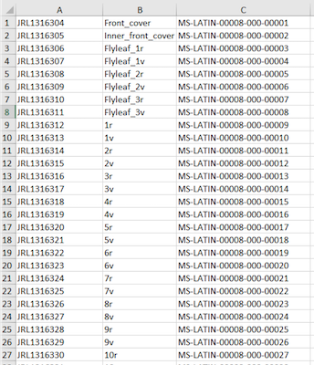

Building on first workshop, getting stuck in to manuscript description.

## Discuss homework from previous exercise

> ## Discussion
>
> - Did you use the file you created, or the template?
> - Did you have any validation errors or other problems?
> - Did you try adding a subject index term?
>
{: .challenge}


## Enable browsing between items
### Loci (or locuses?)
A locus marks information of interest on a particular page. 
In Manchester Digital Collections, this links directly to the correct image (demonstrate)

- Illustrations
- Annotations
- Physical evidence

Manchester Digital Collections enables a live link between the description and the relevant image.


> ## Activity: How do you mark up a locus?
> 
> - Navigate to [Manchester Digital Collections](http://www.digitalcollections.manchester.ac.uk) (MDC).
> - Find Latin MS 8 (Beatus) in the Latin Manuscripts Collection.
> - Download the metadata from MDC and take a look at the `<decoDesc>` section.
>
> ```xml
> <decoDesc><decoNote type="illustration">
> 	<note>For a detailed discussion ... 
> 	      see <ref target="http://www.worldcat.org/oclc/470899747">Peter K. Klein, Beato de Liebana... 2002).</ref>
> 	</note>
> 	<list>
> 		<item>Folio <locus from="1r" to="1r">1r</locus>: Porticus. 
> 			Uncoloured ground at the top, and from the upper border depend blank medallions...</item>
> 		<item>Folio <locus from="1v" to="1v">1v</locus>: Cross supported by the lamb. The ground is blue...</item>
> 	</list>
> </decoNote></decoDesc>
> ```
>
{: .challenge}

> ## How do you link a locus in Manchester Digital Collections?
> 
> In between `<teiHeader>` and `<text>` is the `<facsimile>` section. 
>
> This describes the object in terms of at least one `<surface>` element.
>
>  - `<surface>` contains the attribute `xml:id` and the attribute `n`.
>  - `n` enables `<locus>` to link to the correct image.
>  - `xml:id` enables linking between the image and transcription `<text>`.
> 
> ```xml
> <facsimile>
> 	<surface xml:id="i9" n="1r">
> 		<graphic>...</graphic>
> 	</surface>
> </facsimile>
> 
> <text>
> 	<body>
> 		<div>
> 			<pb n=“1r” xml:id="pb-1r" facs="#i9"/> ...
> 		</div>
> 	</body>
> </text>
> ```
>
> Within `<surface>` the element `<graphic>` contains attributes for image metadata.
> 
> ```xml
> <surface xml:id="i1" n="Front_cover">
> 	<graphic n="JRL1316304" decls="#downloadImageRights #download" rend="portrait" 
> 	 height="5500px" width="3797px" 
> 	 url="MS-LATIN-00008-000-00001.jp2"/>
> </surface>
> ```
> > ## Solution
> >
> > Show facsimile on MS 8. The `<facsimile>` section brings together information about the digital and physical objects in the TEI file. 
> > This programming enables the system/reader to link different pieces of information together in one relatively straightforward phrase.
> > 
> {: .solution}
{: .challenge}

## Manifests

Manifests enable the automatic population of the `<facsimile>` element.
Photographers and cataloguers normally complete these, but they may need curatorial advice.
They combine relevant information in a single spreadsheet.

- jrl (image) number
- Folio number of physical object
- Reference number of digital object

[](../files/MS-LATIN-00008.xlsx)

Thankfully, this doesn’t require coding up – the manifest will do this work for you! 
We have [spreadsheets](../files/MS-LATIN-00008.xlsx) with three columns 
to bring together the important information needed to identify and bring together 
the relevant information. 
There has been some training for cataloguers and non-Special Collections people on different terminology and practice 
(eg. foliation/collation/page numbering) but more work is taking place to standardise this.

Now, have a go at one or more of these exercises to practice manifests, marking up, 
or just familiarising yourself with the makeup of some of these records.

> ## Exercise: Explore the TEI metadata for Latin MS 8
> in Oxygen – focus on `<facsimile>` and `<locus>`
>
> The XML record is available here to download: [MS-LATIN-00008-for-loci.xml](../files/MS-LATIN-00008-for-loci.xml)
> (Right-click, "Save Link As...")
> 
> Available under CC BY-NC 4.0 licence.
>
{: .challenge}

> ## Exercise: Mark up the `<locus>` for Latin MS 164
> in Oxygen
> 
> The XML record is available here to download: [MS-LATIN-00164-for-loci.xml](../files/MS-LATIN-00164-for-loci.xml)
> (Right-click, "Save Link As...")
> 
> Available under CC BY-NC 4.0 licence.
>
{: .challenge}

> ## Exercise: Fill in the gaps in the sample manifest for Latin MS 8 
> and compare this to the published facsimile in Manchester Digital Collections
>
{: .challenge}


## Authorities and index terms

There are many authorities you can link to in TEI. The ones we use are:

- [VIAF](http://www.viaf.org) (for people, places, corporations and other entities)
- [Library of Congress Subject Headings](http://id.loc.gov/authorities/subjects.html) 
(for topics of manuscripts)
- [Worldcat](https://www.worldcat.org/) (for bibliography)

> ## Suggestion from curator [ELIZABETH OR JO???? FIXME]
> Sometimes, Worldcat and VIAF have duplicates, I tend to go with the first hit for convenience.  
> There will be many instances, especially with more modern figures, of multiple people with the same name. 
> In this instance you have to use other evidence to find the right one – dates of birth, etc.
{: .testimonial}

### VIAF
‘William of Conches’ (a medieval author): 
go to VIAF, search for him under ‘personal names’. 
There are two hits; I will go with the top, more complete one. 
Copy the ‘permalink’.

```xml
<name type="person" subtype="aut" ref="http://viaf.org/viaf/25921941"> 
	<persname type="standard">William of Conches, 1080-1154</persname> 
	<persname type="display">Conches, William of (b. C. 1080, d. 1154), theologian<persname>
</name>
```

The entity within `<name/>` can be inserted into any field, including `<author/>` or within free text.

### Library of Congress Subject Headings
These go in a special section at the bottom of the record. I include as many as seem relevant. 

```xml
<profiledesc>
	<textclass>
		<keywords scheme="#LCSH">
			<list>
				<item><ref target="http://id.loc.gov/authorities/names/n78095796">
					Bible. Revelation</ref></item>
				<item><ref target="http://id.loc.gov/authorities/subjects/sh85013597">
					Bible--Commentaries</ref></item>
			</list>
		</keywords>
	</textclass>
</profiledesc>
```

### Worldcat

This goes in the `<listbibl/>` tag which is a special section near the end of the record. 
Again, it’s about finding the correct record and copying the URL to paste in.
 
```xml
<listbibl>
	<bibl>
		<ref target="http://www.Worldcat.org/oclc/956252269">
			M. R. James, A Descriptive Catalogue of the Latin Manuscripts in the 
			John Rylands Library at Manchester (Manchester, 1921), 
			reprinted with an introduction and additional notes and corrections 
			by F. Taylor (München, 1980).
		</ref>
	</bibl>
</listbibl>
```

> ## Authority terms: what do you think?
> - What sources do you use for authority terms?
> - How do we ensure consistency between different formats and finding aids?
> - How much should we use them?
>
> FIXME Homework [MS-LATIN-00006-for-homework.xml](../files/MS-LATIN-00006-for-homework.xml) 
(Right-click, "Save Link As...")
>
> Available under CC BY-NC 4.0 licence.
>
{: .challenge}



